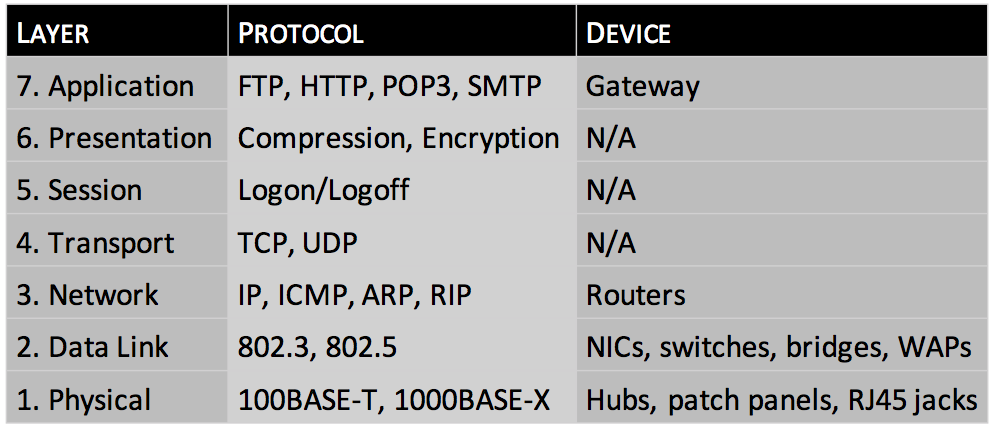

# Object-oriented Javascript and jQuery

# Week 2, Day 1

### Block 1: How the Internet Works

- Understand the difference between a *client* and a *server*
- Be able to build URLs
- Have a fundamental knowledge of security

#### OSI Model


#### Network Ports + Glossary
<a href="https://github.com/ga-students/WDI_Chi_Darth_Vader/blob/master/02_object_oriented_js_and_jquery/networking_ports_and_glossary.md">See this markdown page</a>.

#### URI/URL Structure
`protocol://subdomain.domain.com:port/resource`

- http://google.com:80
- https://yahoo.com/news
- ftp://user@website.com/my_directory
- ssh://root@ga.co/delete_all_the_things
- mysql://dbadmin@somesite.com:3306/my_db
- mongo://dbadmin@anothersite.com/new_db

### Block 2: Objects in Javascript

- Ability = method (a function owned by an object) = verb
- Attribute = property = noun
- Objects contain a **key** with an associated **value**.
- Attributes must be numbers, strings, arrays, or other objects
- Abilties must be functions
- `var obj = {};` or `var obj = new Object();`
- Does an Object contain an attribute or ability? Check using `myObject.hasOwnProperty("nameOfProperty");`
- More here: <a href="https://github.com/ga-students/WDI_Chi_Darth_Vader/blob/master/02_object_oriented_js_and_jquery/javascript_objects.md">

#### Example

```javascript
// best practice
var james = {

	name: "James",
	age: 31,
	saySomething: function() {
		console.log("yolo is a no go");
	},
	isCool: false,
	friends: ["Tom", "Marion", "Angie", "all y'al"],
	goOutside: function() {
		console.log("/me goes outside!!!!!");
	}
};

// old school
var james = new Object();
james.name = "James";
james.saySomething = function() {
	console.log("yolo is a no go");
};
james.isCool = false;

// array vs object
var arr = [];
var obj = {};
```

### Block 3: Object Lab
- <a href="https://github.com/ga-students/WDI_Chi_Darth_Vader/blob/master/02_object_oriented_js_and_jquery/d01/ASSIGNMENT_FILES/lab/objects_objects_everywhere.md">Lab is here!</a>
