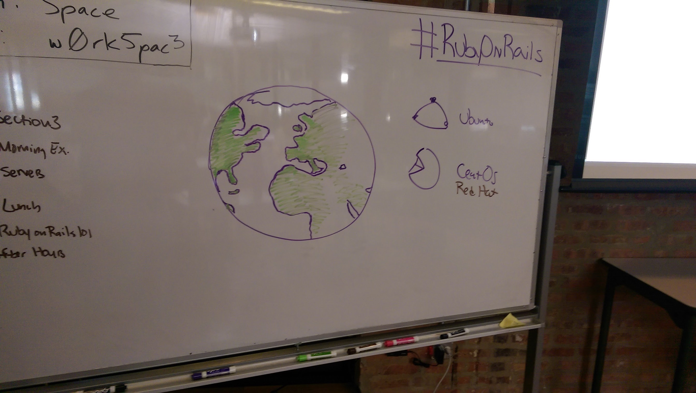

---

<strong>Ruby on Rails</strong>
<h3>Getting Started</h3>

---


*Earth*, by Tim Rourke


---

### Bookmarks!
- **Official Ruby on Rails website**: http://rubyonrails.org/
- **Official Ruby on Rails Github repository** (you should star this!): https://github.com/rails/rails
- **Official Rails Twitter**: https://twitter.com/rails
- **Getting Started with Rails**: http://guides.rubyonrails.org/getting_started.html
- **Official Command Line Documentation**:  http://guides.rubyonrails.org/command_line.html
- **Rails for Zombies**: http://railsforzombies.org/
- **Michael Hartl's Rails Tutorial**: https://www.railstutorial.org/book/
- **Learn Ruby and Rails**: http://www.learnrubyandrails.com/

---


##1. Create & open a new Rails project
**Note:** If you do not have Rails installed, you must install the gem: `gem install rails`!

This is a step-by-step guide to creating a new Rails application. Let's get started! To create a new rails app, you use the following syntax:
- `rails new app_name -d postgresql -T`

Where `app_name` is the name of your application. For example, to create an app called `Coffee_Shop`, I would enter the following into my terminal: `rails new Coffee_Shop`

The `-d postgresql` tells rails to configure the application to use postgres

The `-T` tells rails to ommit including the default rails testing framework

This will create a new Ruby on Rails application in a new desdecent folder named after my app's name in the `rails new` command. Enter `ls` to see the folder and then `cd your_app_name` to move into your new app. To open your new Rails project, in **atom**, enter the following command: `atom .`

##2. Updating your Gemfile
Locate your application's `Gemfile`. Inside of it, you will comment out the following gem(s):

- `gem 'coffee-rails', '~> 4.1.0'`

You will also add the following gem(s):
- `gem 'rspec-rails'`

Once you've edited your `Gemfile`, it is time to feel the ground shake and `bundle`!

##3. Working with your project locally
- To view your project in the browser you will need to run a server (similar to `rack`).
- In your terminal, enter `rails server`
- Unlike `rack`, your project will be served at: `http://localhost:3000/`
- Note the difference in ports: `9292` vs `3000`

- To view your project in the console you will run `rails console`
- From this console, you can test out your models, for example.

##4. Generating Models
To generate a model for your project, you can run the following command:
- `rails generate model Name product_name:string description:text`

**Note: because we strive for efficiency, we'r going to start calling our rake commands in the `bin/` directory inside of our project!!!**

##5. Database Setup/Creation
To automatically generate SQL database tables based on your models, you can run the following command:
- `bin/rake db:create`

To run any changes in your migration scripts, you must run:
- `bin/rake db:migrate`

Finally, to create test entries for RSpec tests, you must run the following command:
- `bin/rake db:test:prepare`

##6. Creating Routes/Controllers
Create a controller to go along with our model.
- `bin/rails generate controller roasts index show edit new`

Where `rails generate controller` specifies that we're creating a new controller. `roasts` is the name. `index show edit new` are the actions to be generated in our controller.

We can also delete actions:
- `bin/rails d controller roasts index show edit new`

- `bin/rake routes` returns a list of routes in your Rails project.


##7. Install RSpec in your Project

Once you have included `rspec` in your project, you may generate unit test specs using the following command(s) in your termnial:

`rails generate rspec:install`


To run your tests in the command line:

- `bin/rake spec`

##8. Example RSpec Unit Test

```ruby
require 'rails_helper'

RSpec.describe Object, type: :model do

	describe 'given an object' do
		before do
			@object = Object.new()
		end

		describe '#to_s' do
			it 'returns an object is an "Object"' do
				expectation = @object.to_s # should return 'Object'
				actual = 'Object'
				expect(expectation).to eq(actual)
			end
		end

	end

end
```

####Misc
- In RSpec, `.` is a class method and `#` is an instance method


##Further Reading
- **Official Command Line Documentation**:  http://guides.rubyonrails.org/command_line.html
