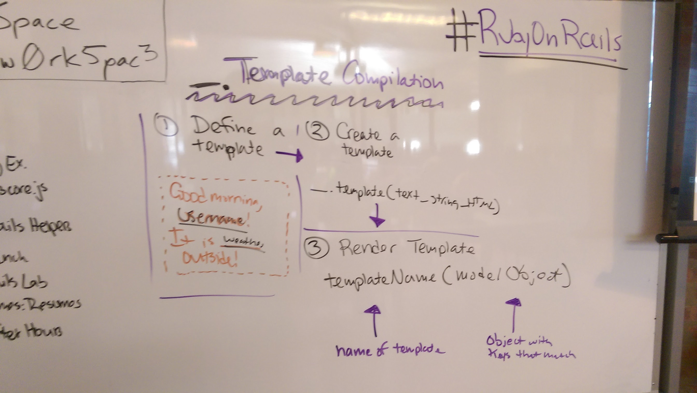

## Underscore Templates



**Example from class**: http://codepen.io/code-for-coffee/pen/YXMqbv

#### Ways to render strings with dynamic values

```javascript
var name = 'vader',
	hobby = 'dueling',
	food = 'anything liquid',
	age = 49;

// string concatenation
var stringBuilder = name + ' enjoys ' + hobby + ' while eating ' + food + ' and is ' + age + ' years old';

// ruby
//var stringBuilder = '#{name} enjoys #{hobby} while eating #{food} and is #{age} years old';

// the underscore way
var story = "<%= name %> enjoys <%= hobby %> while eating <%= food %> and is <%= age %> years old";
```

#### Building a Template with Underscore

* 1 - Define a Template

Take some re-usable HTML..

```html
<h1>Welcome, Brad</h1>

<p>Today's outlook is positive, with a chance of sunshine. Have a great day!</p>
```

* 2 - And turn it into a template!

```html
<h1>Welcome, <%= username %></h1>

<p>Today's outlook is <%= outlook %>, with a chance of <%= weather %>. Have a great day!</p>
```

Now, place it in your HTML...
```html
<div id='content'></div>

<script type='text/template' id='welcome'>
  <h1>Welcome, <%= username %></h1>
  <p>Today's outlook is <%= outlook %>, with a chance of <%= weather %>. Have a great day!</p>
</script>
```

* 3 - Render Template

```javascript
var newModel = {
  username: 'Grand Moff Tarkin',
  outlook: 'Grim',
  weather: 'the death star blowing up'
};
// create a re-usable template function
// based off of the template variable of newTemplate
var newCompiledTemplate = _.template(newTemplate);
// render that shit
$('#content').append(newCompiledTemplate(newModel));
```
