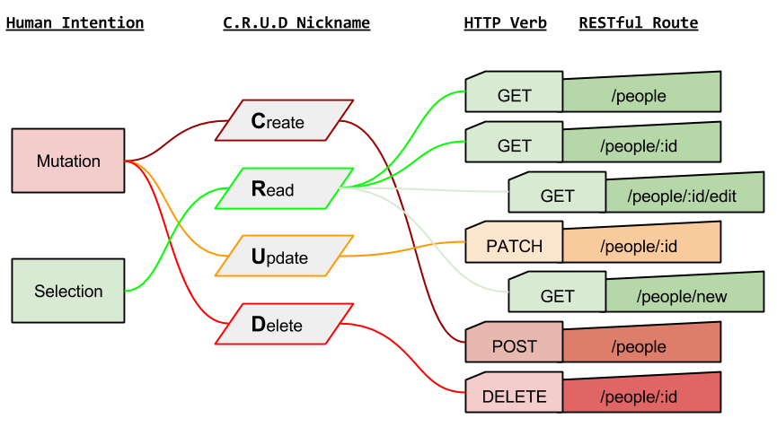

## RESTful APIs

REST stands for *Representational State Transfer*.



#### Actions

- Get All
- Get Individual By Id
- Create
- Update
- Destroy

#### Ruby Example (Sinatra)

```ruby
# GET: List
get '/api/cats' do
  Cat.all.to_json
end

# GET: By Id
get '/api/cats/:id' do
  puts params
  Cat.find(params[:id]).to_json
end

# POST: Create
post '/api/cats' do
  puts params
  Cat.create({
    :name => params[:name],
    :breed => params[:breed]
  }).to_json
end

# PATCH: Update by Id
patch '/api/cats/:id' do
  cat_args = { :name => params[:name], :breed => params[:breed] }

  @cat = Cat.find(params[:id])
  @cat.update(cat_args)
  @cat.to_json

end

# PUT: Update by Id
put '/api/cats/:id' do
  cat_args = { :name => params[:name], :breed => params[:breed] }

  @cat = Cat.find(params[:id])
  @cat.update(cat_args)
  @cat.to_json

end

delete '/api/cats/:id' do
  Cat.destroy(params[:id]).to_json
end
```

#### Example Project

We created the following RESTful API: https://github.com/ga-chicago/RESTfulCats

#### C# Example

```c#
// using CatsModel

public CatsController {

	[HttpGet]
	public CatsModel List<CatsModel>(object cats) {
		return Cats.all();
	}

	[HttpGet]
	public CatsModel (int id) {
		return Cat.find(id);
	}

	[HttpPost]
	public CatsModel (object Cat) {
		return Cat.save(Cat);
	}

	[HttpPatch]
	public CatsModel (object Cat) {
		return Cat.update(Cat);
	}

	[HttpPut]
	public CatsModel (object Cat) {
		return Cat.update(Cat);
	}

	[HttpDelete]
	public CatsModel (int id) {
		return Cat.delete(id);
	}

}
```
