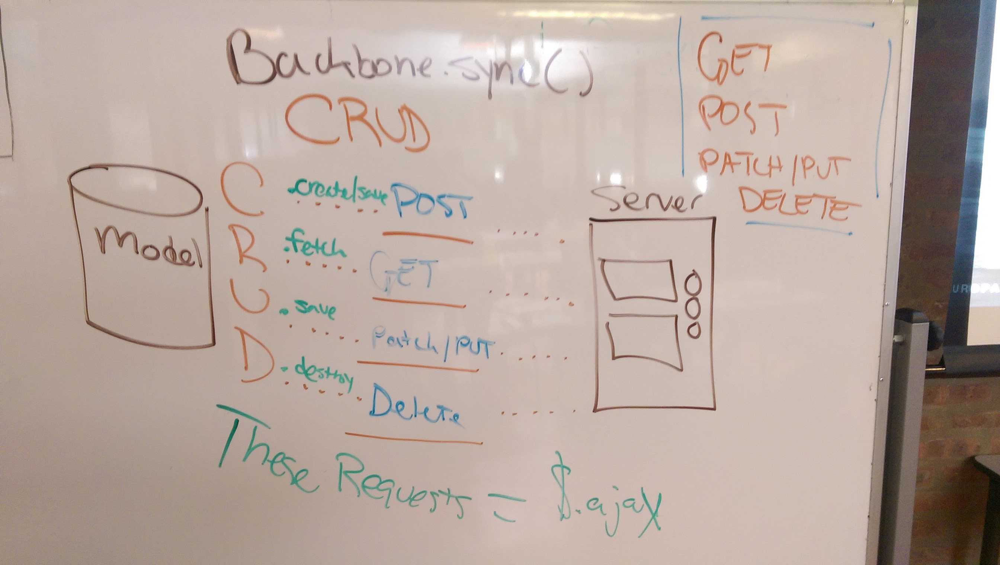

## Backbone.js Models



- Models are designed to interact with a data source.
- They are the *truth* in your application.
- Backbone's models are designed to connect to individual items in an API but can be used for singular objects.
- Open the console and create the following model line by line & describing:

```javascript
// using http://openweathermap.org/weather-data#current
var Weather = Backbone.Model.extend();
// we're going to use open weather
// create a new instane of Weather
var forecast = new Weather();
// show empty attributes
console.log(forecast.attributes);
// set url to get data from
forecast.url = "http://api.openweathermap.org/data/2.5/find?q=Chicago&units=imperial";
// fetch data from API
forecast.fetch();
// console log out new attributes
console.log(forecast.attributes);
// we're going to use a model's getter to get a value from the attributes
var data = forecast.get("list");
// log out data
console.log(data[0].main);
// put some data together
var weatherData = {
  location: data[0].name,
  humidity: data[0].main.humidity,
  temp: data[0].main.temp
};
// cool, let's make a template
// ah, see where I'm going with this?
// an underscore template
var template = _.template("It is <%= temp %> degrees Farenheight in <%= location %> with <%= humidity %> percent humidity.");
// now render it all together
template(weatherData);
// now, let's add this to the DOM, shall we?
$('body').html(template(weatherData));
```


### Attributes and history inside of a model
- Models have the `attributes` object
- You **get** and **set** values; these are used to trigger events
- `attributes` is just where your data is temporarily stored!
- Here is a **Weather** model. It logs out the model's attributes before and after a fetch.

```javascript
var Weather = Backbone.Model.extend({
  url:
  initialize: function() {
    console.log("- Weather View has been created. Here are its attributes -");
    console.log(this.attributes);
    this.fetch();
    console.log("- Weather View has called fetch()! It is super effective! here are new attributes -");
    console.log(this.attributes);
  }
});
var weather = new Weather({url: "http://api.openweathermap.org/data/2.5/find?q=Chicago&units=imperial"});
```

- Models store information about themselves, too. There is also a changed/history object.
- Constructors automatically bind certain values in models like they do in views (remember `el`?)


### Questions to Consider

Q: How do you think that models work?

Q: What properties and abilities have you seen that models have?

Q: What properties and abilities do you think models have?
